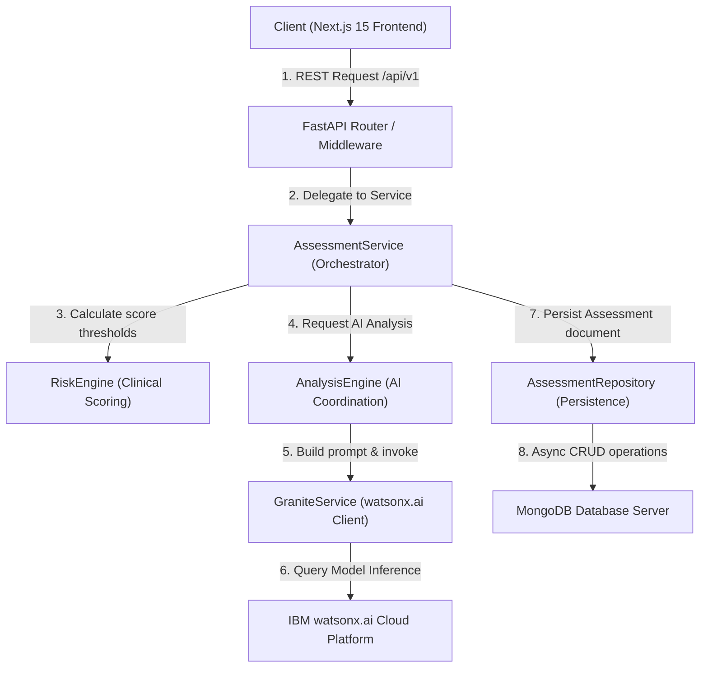

# MindCare AI - Architecture Documentation

This document explains the high-level system architecture, data flows, and separation of concerns across each layer of the MindCare AI platform.

---

## System Architecture Diagram

---

## Layer-by-Layer Responsibilities

### 1. Presentation Layer (Next.js 15 Frontend)
- **Role**: Client UI interface.
- **Responsibilities**:
  - Manages local UI states (questionnaire steps) using `React Hook Form`.
  - Performs local input validation with `Zod`.
  - Communicates with FastAPI backend asynchronously via `Axios` and `TanStack Query`.
  - Strictly presents clinical risk levels, AI analysis summaries, and checklists to the user. No business logic or scoring calculation is performed in the frontend.

### 2. REST API & Middleware Layer (FastAPI Routers)
- **Role**: HTTP Interface.
- **Responsibilities**:
  - Handles routing, mapping parameters, and response models.
  - Enforces API versioning under `/api/v1/`.
  - Runs request-scoped dependency injection lifecycle.
  - **Logging Middleware**: Generates unique `X-Request-ID` and `X-Process-Time` headers, and logs one structured entry per request.
  - **Exception Handlers**: Maps standard validation errors (422), schema issues (400), and internal exceptions (500) to a single, consistent JSON schema.

### 3. Orchestration Layer (AssessmentService)
- **Role**: Application orchestration wrapper.
- **Responsibilities**:
  - Coordinates domain layers: invokes `RiskEngine` to compute score aggregates, delegates to `AnalysisEngine` to invoke watsonx AI, and calls `AssessmentRepository` to persist the results.
  - Insulates route handlers from knowing about database internals or AI prompt logic.
  - Automatically appends generated timestamps and model configurations to the assessment document.

### 4. Domain Engine Layer (RiskEngine & AnalysisEngine)
- **Role**: Core business logic.
- **Responsibilities**:
  - **RiskEngine**: Processes PHQ-9 (depression), GAD-7 (anxiety), stress scores, sleep patterns, lifestyle habits, and subjective wellbeing metrics. Outputs raw score aggregates and mapped severity classifications.
  - **AnalysisEngine**: Dynamically constructs prompting strings, triggers watsonx.ai inference calls, and forwards responses to the validation layer.

### 5. AI Validation Layer (ResponseValidator)
- **Role**: Schema enforcement.
- **Responsibilities**:
  - Verifies that responses received from the AI model conform strictly to the required structured JSON schema.
  - Asserts that all required fields are present and non-empty. Raises `GraniteValidationError` if structural validation checks fail.

### 6. Persistence Repository Layer (AssessmentRepository)
- **Role**: Pure data persistence.
- **Responsibilities**:
  - Performs CRUD database actions on the MongoDB collection using `Motor` (async driver).
  - Handles low-level MongoDB-to-JSON serialization (e.g. converting `_id` to safe string IDs).
  - Contains zero business logic, API routing knowledge, or AI configurations.
